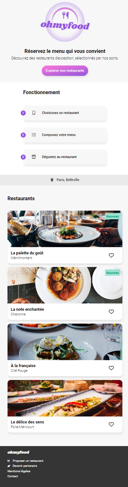

<h1>OC_P3</h1>

<div align='center'>

 
 
</div><br>

<h2>ohMyFood - Book your Restaurant and menu</h2>

<strong>GitHub Page:</strong> https://git-ej.github.io/OC_P3/


[](https://github.com/Naereen/StrapDown.js/blob/master/LICENSE)


<strong>Project:</strong> From scratch, mobile first. 

<strong>Project goal:</strong>  Implement relevant css animations.

<strong>Personal addition:</strong> Logo, and loading spinner.


<strong>Install dependencies:</strong>

```
npm i
```

<strong>run sass</strong>

```
npm run sass
```

<strong>Screenshot:</strong>

<div align='center'>

 
 
</div>